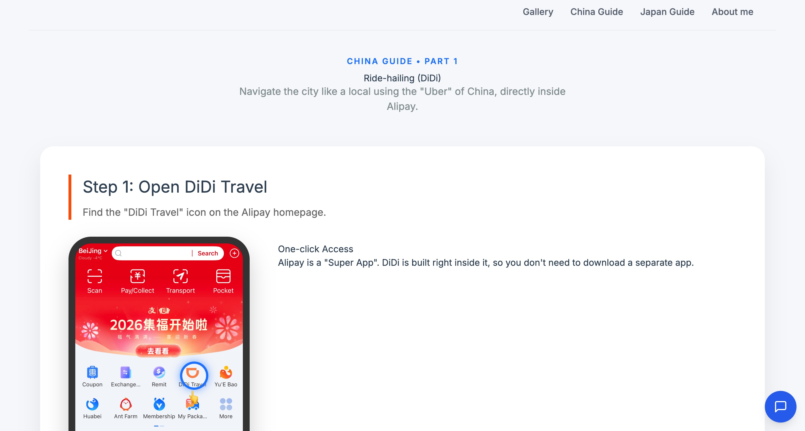
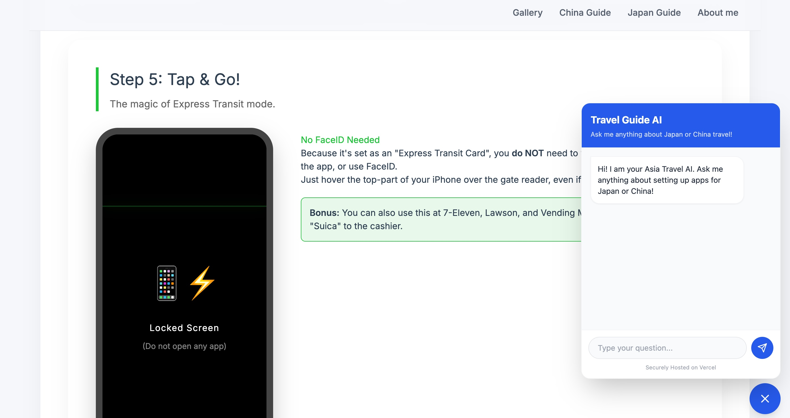
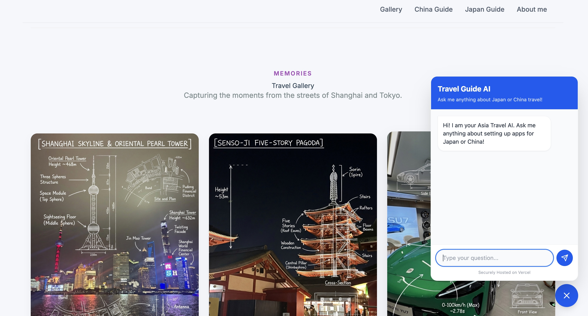
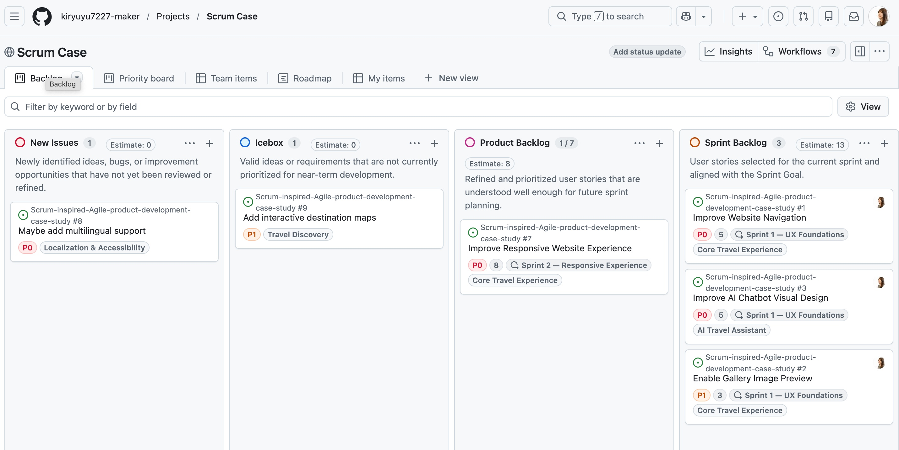
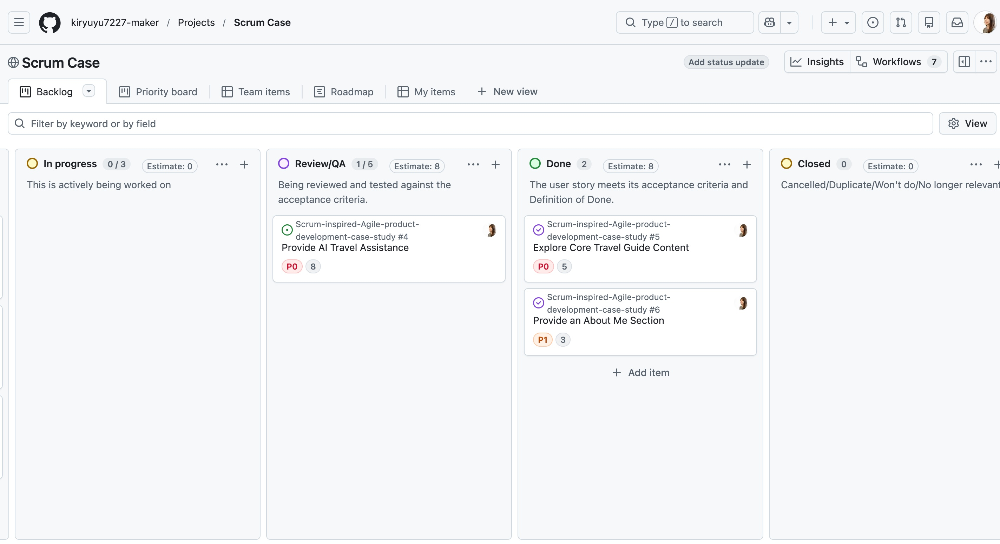

# China & Japan Travel Guide with AI Assistant

An AI-enabled travel guide designed to help travelers explore China and Japan, discover destination content, and access travel guidance through an integrated AI assistant.

This project also serves as a **Scrum-inspired Agile product development case study**, where I apply user stories, acceptance criteria, backlog refinement, relative estimation, prioritization, sprint planning, and QA to iteratively improve an existing MVP.

## Live Demo

[View the live website](https://chinajapantravelguidewithaichat-git-main-yukiryus-projects.vercel.app/)

> The product is under active development. Some planned features and UX improvements are currently managed through the Product Backlog.

## Product Goal

**Enable travelers interested in China and Japan to explore destinations, find relevant travel information, and get personalized guidance through a simple AI-powered travel experience.**

## Current Features

### Travel Guide Content

The website provides structured travel content covering China and Japan, designed to help visitors explore destinations and find travel inspiration.

### Destination Gallery

A visual gallery introduces destinations and travel experiences through photography.

### AI Travel Assistant

An integrated AI chatbot allows users to ask travel-related questions and receive guidance directly within the website.

### About Me

An About Me section gives visitors context about the creator and the perspective behind the China and Japan travel guide.

### Responsive Web Experience

The website is designed for use across different screen sizes, with further responsive UX improvements included in the Product Backlog.

---

## Agile Product Development Case Study

Rather than treating the website as a one-time development project, I am using the existing MVP as the basis for an iterative Agile product development exercise.

Customer-facing improvements and product ideas are captured as backlog items and refined into user stories using the format:

> **As a** [user role]
> **I need** [function]
> **So that** [benefit]

Each refined story includes:

* Details and assumptions
* Gherkin-style acceptance criteria
* Priority
* Relative Story Point estimation
* Epic
* Sprint / Iteration
* Workflow status

The objective is to practice applying Agile concepts to a real working product rather than only learning them theoretically.

## Agile Workflow

The project workflow currently includes:

**New Issue → Icebox → Product Backlog → Sprint Backlog → In Progress → Review / QA → Done**

* **New Issue** — newly identified ideas, bugs, or opportunities requiring refinement
* **Icebox** — valid ideas that are not currently prioritized
* **Product Backlog** — refined items available for future prioritization and sprint planning
* **Sprint Backlog** — stories selected for the current Sprint
* **In Progress** — work currently being implemented
* **Review / QA** — implementation being validated against its acceptance criteria
* **Done** — work that meets the acceptance criteria and Definition of Done

## Current Sprint

### Sprint 1 — UX Foundations

**Sprint Goal**

Improve the core usability and visual consistency of the travel guide so visitors can navigate content easily, explore destination imagery, and interact with the AI assistant more naturally.

### Sprint Backlog

| User Story                       | Priority |  Estimate |
| -------------------------------- | -------- | --------: |
| Improve Website Navigation       | High     |      5 SP |
| Enable Gallery Image Preview     | Medium   |      3 SP |
| Improve AI Chatbot Visual Design | High     |      5 SP |
| **Total**                        |          | **13 SP** |

## Product Backlog Examples

Current and planned improvements include:

* Improve website navigation and section linking
* Enable enlarged gallery image previews
* Improve the visual design of the AI chatbot
* Improve responsive website behavior
* Add multilingual support
* Explore interactive destination maps

Each feature is managed as a user-focused backlog item rather than only as a technical task.

## Project Board

The Agile planning and delivery workflow can be viewed here:

[View the GitHub Project Board](https://github.com/users/kiryuyu7227-maker/projects/3/views/1)

The project is also connected to Zenhub for additional Agile workflow management.

---

## Technology Stack

### Frontend
- HTML5
- CSS3
- Responsive design with CSS media queries
- Google Fonts

### Styling
- Custom CSS

### AI
- Google Gemini API
- API key created and managed through Google AI Studio
- AI-powered travel chatbot integration

### Deployment
- Vercel

### Product & Delivery Management
- GitHub Issues
- GitHub Projects
- Zenhub
- User Stories & Acceptance Criteria
- Relative Story Point Estimation
- Sprint Planning

---

## Screenshots

## Screenshots

### Travel Guide

### AI Travel Assistant

### Agile Project Board

> Screenshot files will be added to the repository as the case study is developed.

---

## Current Product Improvements

The existing MVP has provided a starting point for identifying usability and product-development opportunities.

Examples currently being addressed through the backlog include:

* Navigation menu does not yet provide the intended expandable navigation experience
* Gallery images cannot yet be opened in an enlarged preview
* AI chatbot functionality exists, but its visual design needs better alignment with the overall website
* Responsive behavior requires further refinement across different screen sizes
* Multilingual functionality and interactive destination maps are being considered as future enhancements

These improvements are being prioritized and delivered iteratively rather than implemented as one large release.

---

## What This Case Study Demonstrates

This project is intended to demonstrate practical application of:

* Translating product needs into user stories
* Writing actionable and testable acceptance criteria
* Applying the I.N.V.E.S.T. principles
* Backlog refinement and prioritization
* Relative estimation using Story Points
* Organizing work into Epics
* Sprint Planning and Sprint Goals
* Managing work through an Agile workflow
* Reviewing completed work against acceptance criteria
* Connecting product decisions with actual implementation

The project is a **self-directed, Scrum-inspired case study**, rather than a simulation of having worked in a full Scrum Team.

---

## Future Development

Potential future enhancements include:

* Multilingual support
* Interactive destination maps
* Further AI travel assistant improvements
* Mobile and responsive UX enhancements
* Additional China and Japan travel content

Future functionality will be refined and prioritized through the Product Backlog before implementation.
